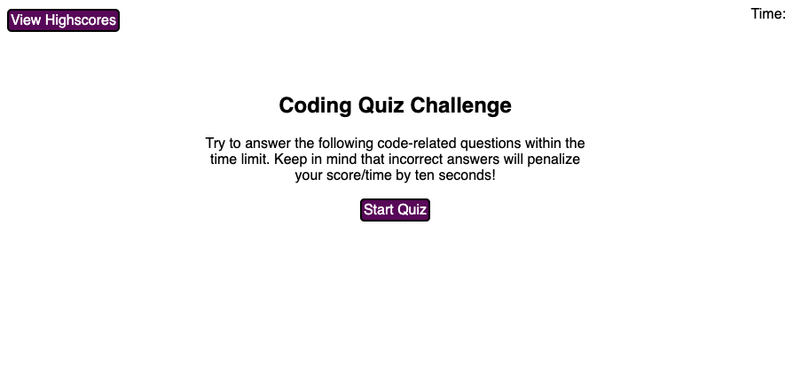
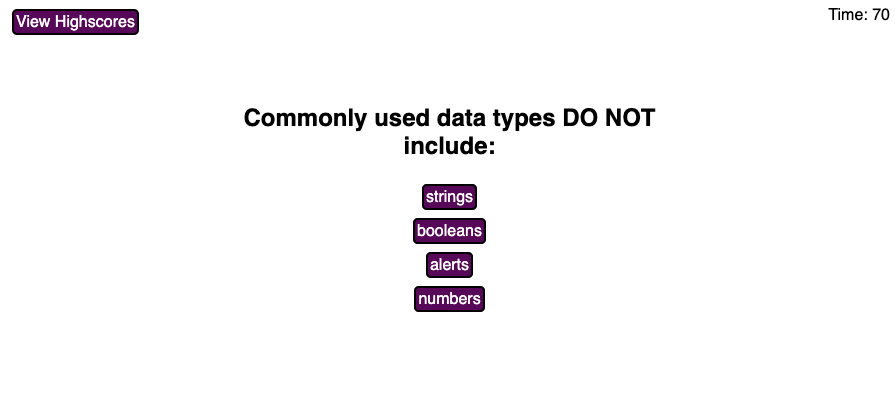
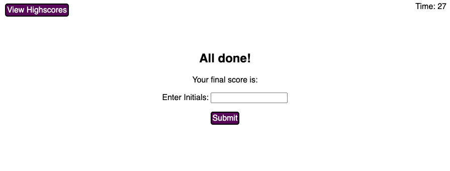
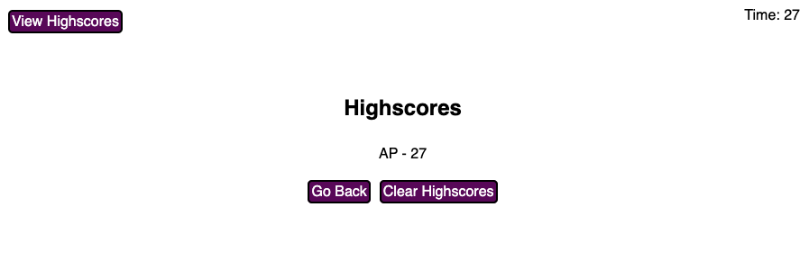

# 04 Web APIs: Code Quiz

## My Task

The task for the app was to create a coding quiz with multiple choice questions. This quiz is timed, and the time left at the end of the questions is the players high score. Players are deducted 10 points/seconds for wrong answers and not penalized for correct answers. High scores are stored and displayed at the end of the game or upon user request. 

## How to play

1. Upon opening the web application, you will be greated with simple instructions. At this point you may either start the game by clicking the "Start Quiz" button, or you may view the high scores (if any exist).

2. Once the game is started, you will have 75 seconds to complete the quiz. The quicker you complete the quiz, the higher your score will be. layers are deducted 10 points/seconds for wrong answers and not penalized for correct answers.

    a. To answer questions, simply click on the purple answer that you believe is correct. You will be alerted at the bottom of the question after each click whether your answer was correct or incorrect. 

3. Upon completion of the quiz, the time remaining in the top right hand corner of the screen is your score. You may enter your initials to save your high score. Once submitted you will be taken to a list of all of the recorded scores.

4. If you would like to try again you can click the Go Back button where you will be taken back to the beginning of the quiz. Or you may clear all the high scores to start a new running tally of high scores.

## Mock-Up
 
Below are a few examples of the user interface:

## Languages
 
* HTML
* CSS
* JavaScript

## Website & Repository

* Github: https://github.com/anthonypacella/CodeQuiz
* Deployed Website: https://anthonypacella.github.io/CodeQuiz/
